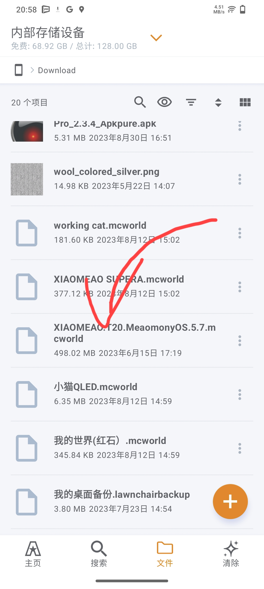

# 如何安装地图
##### 首先，先下载此应用（可以下载有相容的应用

### ColorOS文件管理12破解版下载
[点击这里](https://www.pling.com/p/1686243)

>如手机是OPPO手机,可以使用原装文件
>管理器，无需安装任何软件
>

### 文件管理器下载「随你喜欢」(在play商店）

[点击这里](https://play.google.com/store/search?q=file+manager&c=apps)

### astro文件管理器下载

[点击这里](https://play.google.com/store/apps/details?id=com.metago.astro)

### Files by Google

[点击这里](https://play.google.com/store/apps/details?id=com.google.android.apps.nbu.files)

## 2.找到档案（如果乱）

>在Download文件夹📁内
>

### 点击档案

>有些文件管理器需要点击文档类型
>

https://github.com/Laomao1104/map/assets/124508738/476a8583-b7ed-4e5e-ab02-16f9e5a14f84

### 即可可以完成导入
